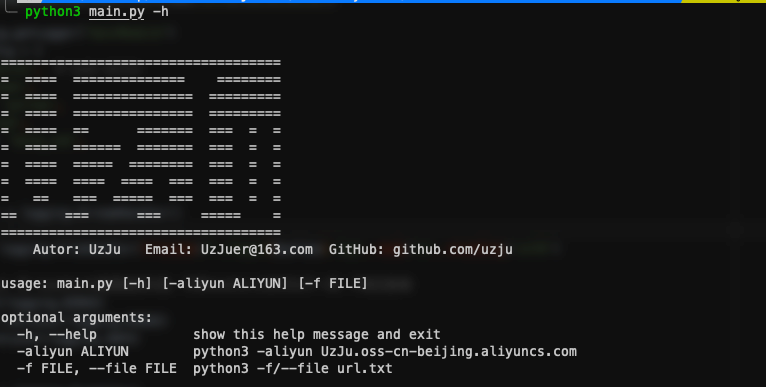
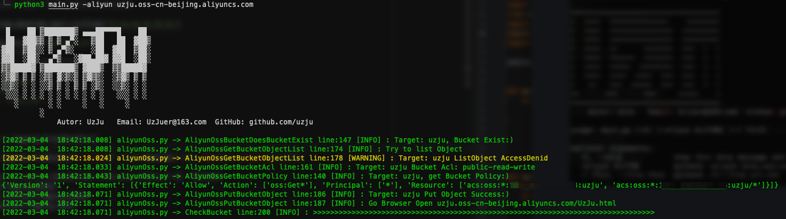
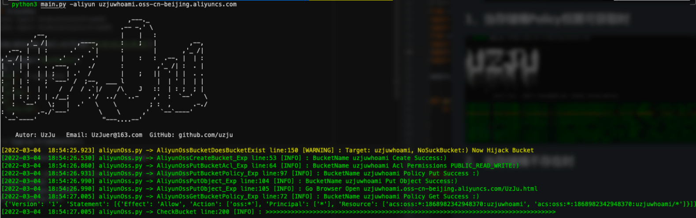
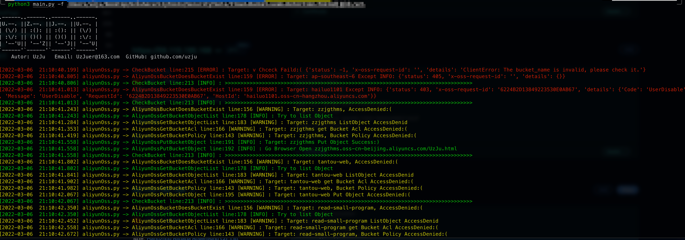
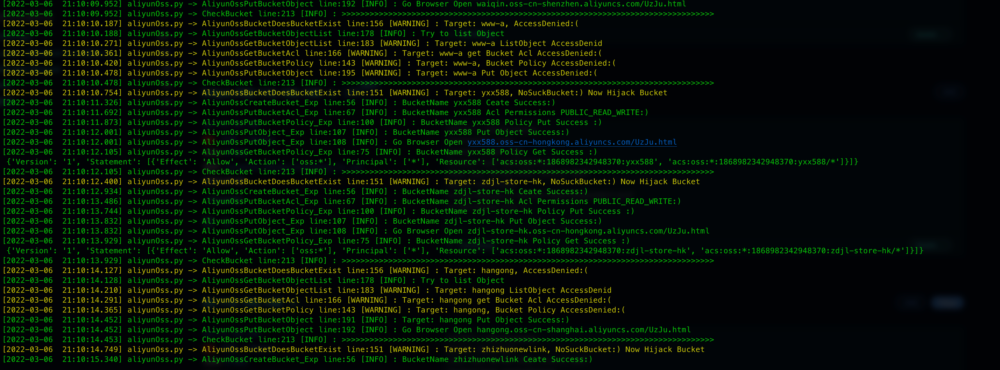
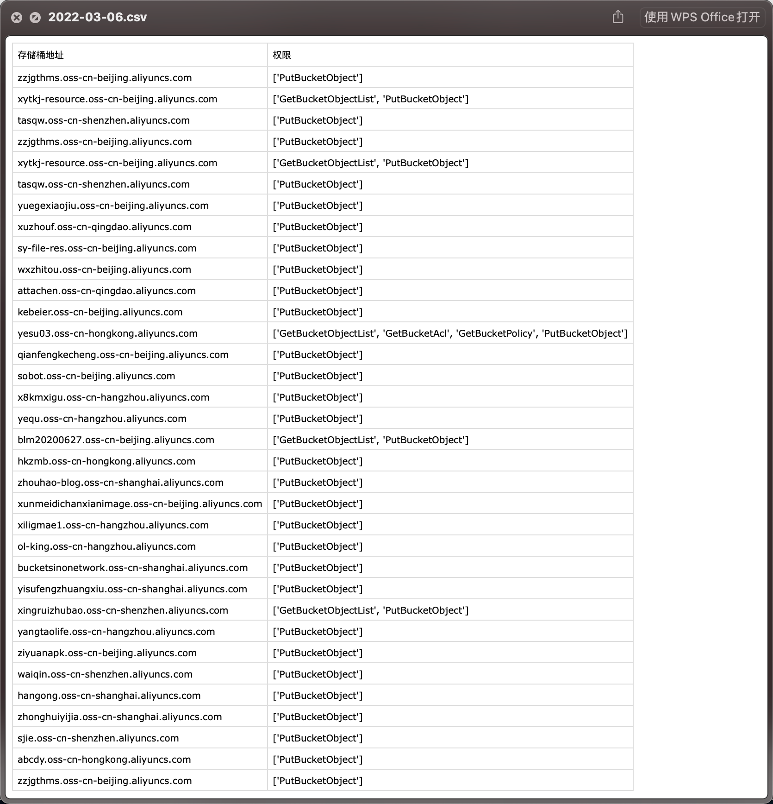
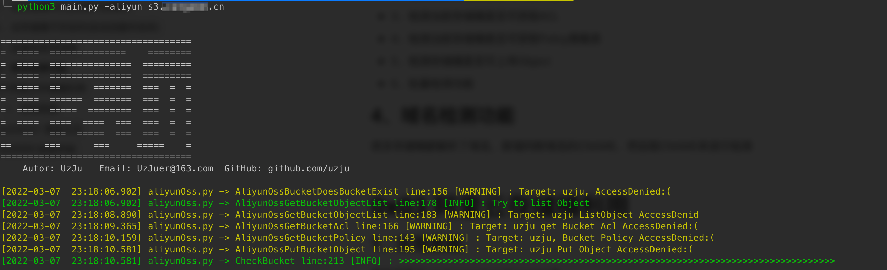
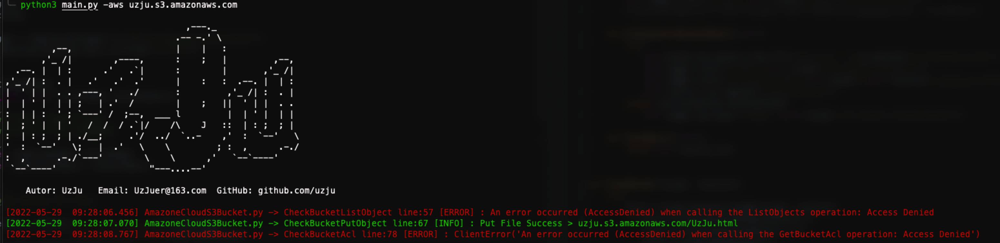
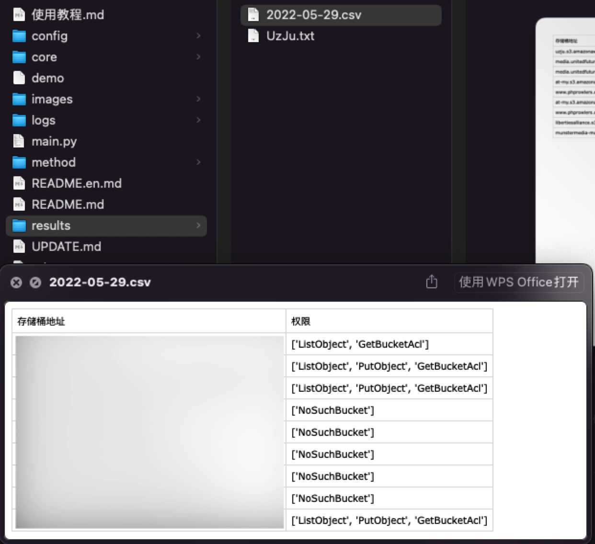

# :rooster:0x00 Preface


> March 7, 2022
>
> I think the documentation is not very clear, wait for the time to update the full documentation of the use of tutorials
> March 8, 2022
>
> May 29, 2022
>
> 1. updated the aws storage bucket detection feature
>
> 2. feel that the update is a bit slow, this is a busy time, in fact, the new local version is written, has not been push

**Using tutorial**: [Using tutorial](使用教程.md)

**Language**

English README: [English](README.en.md)

I want to write a storage bucket utilization, first draw a pie for myself

+ Aliyun Cloud (Aliyun Cloud Oss)
+ Tencent Cloud COS
+ Huawei Cloud (HuaWei Cloud OBS)
+ AWS (Amazon S3 Bucket)
+ Azure (Azure Blob)
+ GCP (Google Cloud Bucket)

I don't even think about the name of the tool, I believe the big guys will know when they see the project name... King of machine flip

If you think it works fine, you can raise an issue to give the tool a name? :sos:

:waning_crescent_moon:**painting pie progress**

1, Ali cloud storage bucket use

Not too good with Git, code writing also sucks, there are bugs directly mention Issue can (as if I may not even use issue to understand)

> Good thing the second master recommended to me GitHub Desktop second master YYDS

2, AWS storage bucket use

# :pill:0x01 dependency

+ pip3 install oss2
+ pip3 install colorlog
+ pip3 install argparse
+ pip3 install boto3

# :gun:0x02 Usage

```bash
git clone https://github.com/UzJu/Cloud-Bucket-Leak-Detection-Tools.git
python3 main.py -h
```

Then write your own Aliyun AK in config/conf.py, the role is as follows

1, if you can hijack, will use the AK to create a storage bucket of the same name

2, used to verify the legitimate user



## 1. When storage bucket Policy permission is available



## 2. When the storage bucket does not exist (automatically created and hijacked)



## 3、Batch detection of storage buckets

New detection function of batch storage bucket, recommend fofa to export all assets with one click

**fofa**

```bash
domain="aliyuncs.com"
server="AliyunOSS" domain="aliyuncs.com" #This syntax is not recommended
```

```bash
python3 main.py -f aws/aliyun filepath

# For example
python3 main.py -f aws . /url.tx\\\\\\\``````````````````````````````````````````````````````````````````````````
```

Then just wait, the scan results will be in the results directory with the date of the day as the filename





Only buckets that have permission to operate will be saved


Input the storage bucket address to detect automatically, the function is as follows

+ 1. detect whether the current bucket can be hijacked
  + If it can be hijacked, automatically create a bucket with the same name on the AK account written in the config and open all permissions
+ 2. detect whether the current bucket can list Object
+ 3. Check if the current bucket can get ACL
+ 4、Check if the current bucket can get Policy policy table
+ 5、Detect whether the bucket can upload Objects
+ 6、Batch detection function

## 4、Domain name detection function

Many storage buckets have resolved the domain name, the new judgment of the domain name CNAME, and then take the CNAME to detect

** can now directly import a large number of domain name assets for detection, will automatically determine the CNAME of the domain name **



# 0x03 Ali cloud storage bucket utilization

### 1、Implementation ideas

First implement the `OssBucketCheckFromSDK` class

+ AliyunOssBucketDoesBucketExist

  + AliyunOssBucketDoesBucketExist is used to determine whether the current bucket exists, first if the bucket exists then return a True, continue with the following process, if the bucket does not exist, then call the OssBucketExploitFromSDK class, create the bucket, and set ACL permissions, upload access policy, then upload a file for verification, if the bucket exists at this time or AccessDenied, continue with the following process

+ AliyunOssGetBucketObjectList

  + determine if the contents of the bucket can be traversed, and if so, the first 3 contents will be selected for traversal and displayed

    > If you want to iterate through more content, you can check the AliyunOssGetBucketObjectList method in aliyunOss.py

+ AliyunOssGetBucketAcl

  + determine if the current Bucket's ACL can be accessed, if so, return the current Bucket's ACL, if not, continue with the following Check process

+ AliyunOssGetBucketPolicy

  + Determine if the policy of the current Bucket can be accessed, if so, the ACL of the current Bucket will be returned, if not, continue with the following Check process

+ AliyunOssGetBucketObject

  + Try to upload a file, whether it can be successfully uploaded

# 0x04 Aws storage bucket utilization

```bash
python3 main.py -aws xxxx
```



# 0x05 Explanation of the results file after use

You can see the problematic bucket in the results directory



1, ListObject means the contents of the bucket can be listed

2、PutObject means that the bucket can upload any file

3、NoSuchBucket means the bucket can be taken over

4、GetBucketACL means you can get the ACL of the bucket

5、GetBucketPolicy means you can get the policy configuration of the bucket

# :older_man:0x040001 Update Log

**March 6, 2022**

+ Add batch scan function
+ Fix the Fake_UserAgent error reporting problem

> actually just delete this library, don't use it ^ ^

**March 7, 2022**

+ Added domain detection

**May 29, 2022**

- Added AWS storage bucket scan

# :cop:0xffffffff Disclaimer

Disclaimers

1、This tool is for academic exchange only, it is forbidden to use the tool to do illegal things

2, just writing for fun

3、My WeChat

> If you have a better suggestion or make a friend


# Curve chart

[](https://starchart.cc/UzJu/Cloud-Bucket-Leak-Detection-Tools)