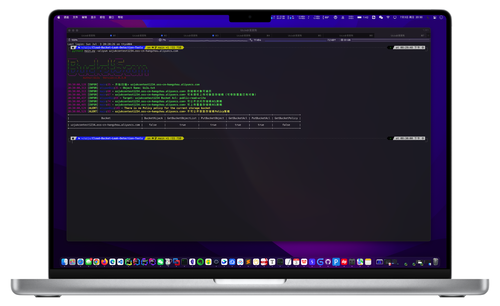

# :rooster:使用教程

```bash
git clone https://github.com/UzJu/Cloud-Bucket-Leak-Detection-Tools.git
cd Cloud-Bucket-Leak-Detection-Tools/
# 安装依赖 建议使用Python3.8以上的版本 我的版本: Python 3.9.13 (main, May 24 2022, 21:28:31)
# 已经测试版本如下
# 1、python3.8.9
# 2、python3.9.13
# 3、python3.7
# 4、python3.6.15
# 5、python3.9.6
pip3 install -r requirements.txt
python3 main.py -h
```

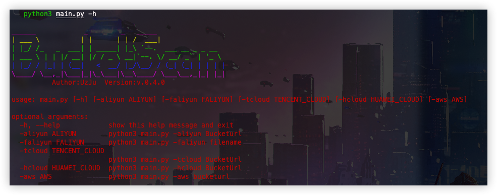

使用之前需要在`config/conf.py`文件配置自己对应的云厂商AK

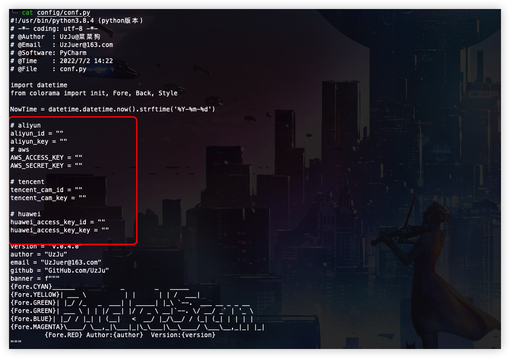

## 1、阿里云存储桶

### 1.1、单个存储桶检测

```bash
python3 main.py -aliyun [存储桶URL]
```

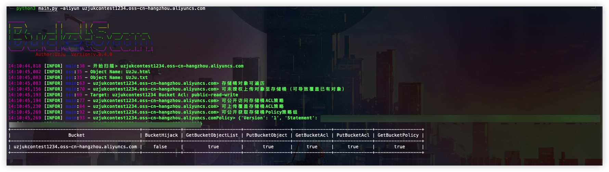

### 1.2、自动存储桶劫持

当如果检测存储桶不存在时会自动劫持该存储桶

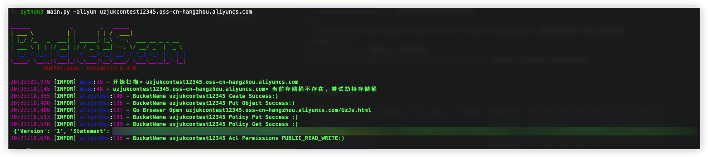

### 1.3、批量存储桶地址检测

```bash
# fofa语法
domain="aliyuncs.com"
server="AliyunOSS"domain="aliyuncs.com"
```

```bash
# 使用-faliyun
python3 main.py -faliyun url.txt
```

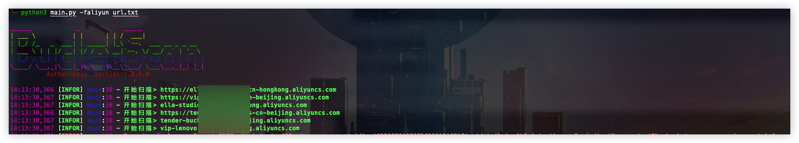

## 2、腾讯云存储桶

```bash
python3 main.py -tcloud [存储桶地址]
```

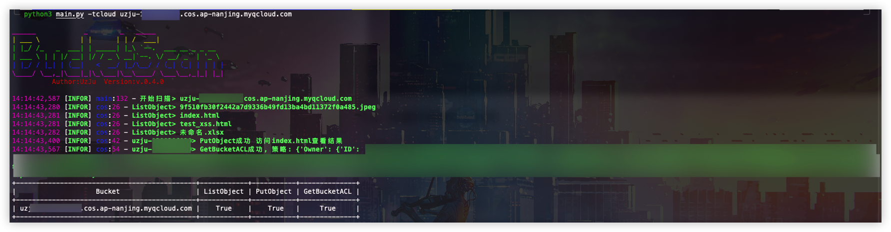

## 3、华为云存储桶

```bash
python3 main.py -hcloud [存储桶地址]
```

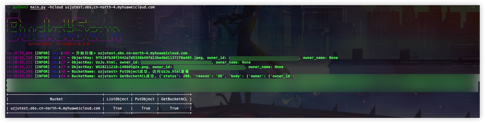

## 4、AWS存储桶

```bash
python3 main.py -aws [存储桶地址]
```

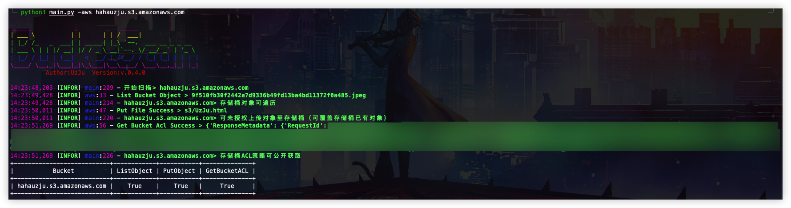

## 5、扫描结果保存

扫描结果会存放在`results`目录下

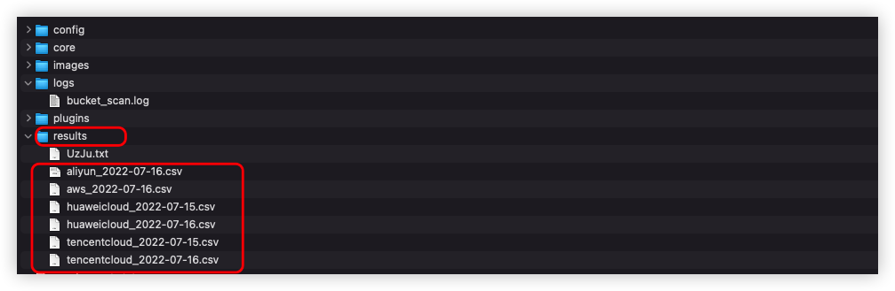

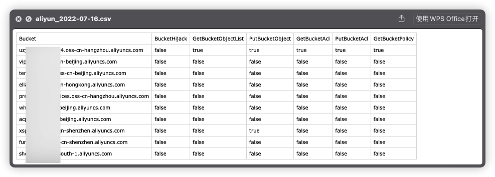

# :cop:0xFFFFFFFF 免责声明

1、本工具只作为学术交流，禁止使用工具做违法的事情

2、只是写着玩

3、我的微信

> 如果你有更好的建议或者交个朋友


4、博客: UzzJu.com
5、公众号


## 404星链计划


**Cloud-Bucket-Leak-Detection-Tools** 现已加入 [404星链计划](https://github.com/knownsec/404StarLink)

# 曲线图

[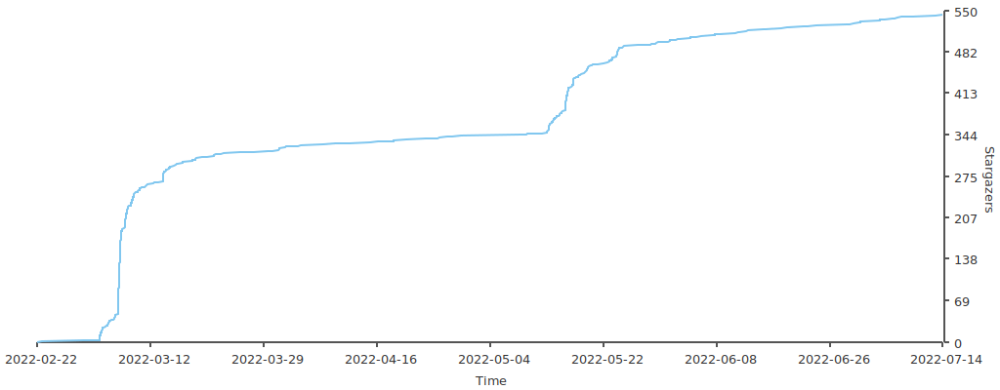](https://starchart.cc/UzJu/Cloud-Bucket-Leak-Detection-Tools)