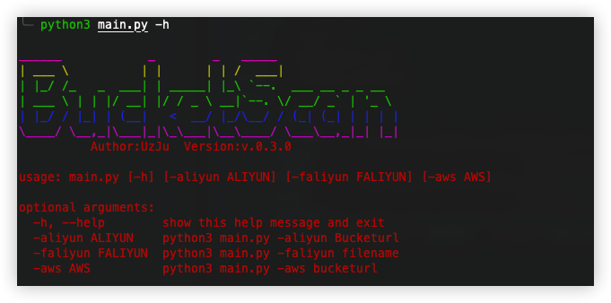
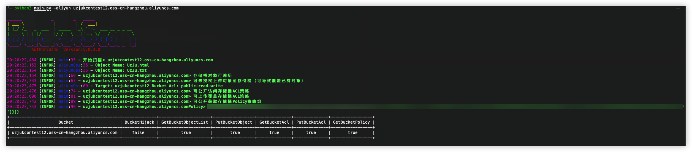
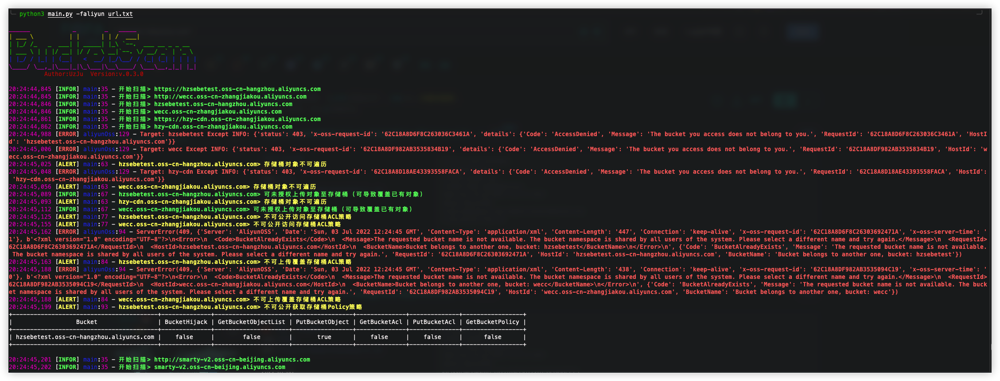
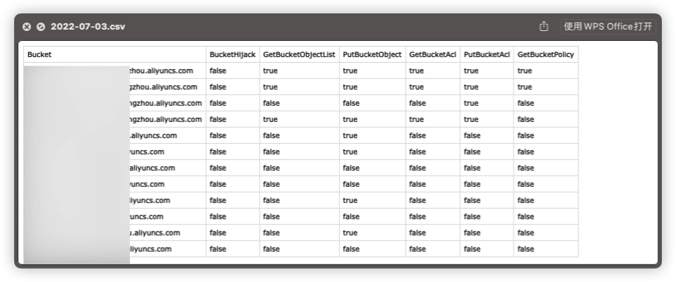

# :rooster:0x00 前言


**使用教程**: [使用教程](使用教程.md)

**语言/Language**

English README: [English](README.en.md)

# :pill:0x01 依赖

```bash
pip3 install -r requirements.txt
```

# :gun:0x02 使用方法

```bash
git clone https://github.com/UzJu/Cloud-Bucket-Leak-Detection-Tools.git
python3 main.py -h
```

随后在config/conf.py中写入自己的AK，作用如下

1、如果可以劫持，会用该AK创建同名的存储桶

2、用来验证合法用户



## 1、当存储桶Policy权限可获取时



## 2、当存储桶不存在时(自动创建并劫持)


## 3、批量检测存储桶

新增批量存储桶的检测功能，推荐fofa一键导出所有资产

**fofa**

```bash
domain="aliyuncs.com"
server="AliyunOSS"domain="aliyuncs.com" #不推荐该语法
```

```bash
 python3 main.py -faliyun url.txt
```

随后等待即可，扫描结果会在results目录下，文件名为当天的日期



随后会将结果保存至csv


输入存储桶地址即可自动检测，功能如下

+ 1、检测当前存储桶是否可劫持
  + 如果可劫持，自动在config中写入的AK账号上创建同命名的存储桶并开放所有权限
+ 2、检测当前存储桶是否可列出Object
+ 3、检测当前存储桶是否可获取ACL
+ 4、检测当前存储桶是否可获取Policy策略表
+ 5、检测存储桶是否可上传Object
+ 6、批量检测功能

## 4、域名检测功能(v0.3.0暂未支持)

很多存储桶都解析了域名，新增判断域名的CNAME，然后取CNAME来进行检测

**现在可以直接导入大量域名资产来进行检测，会自动判断域名的CNAME**


# 0x03 阿里云存储桶利用

### 1、实现思路

首先实现了`OssBucketCheckFromSDK`类

+ AliyunOssBucketDoesBucketExist

  + 用来判断当前存储桶是否存在，首先如果存储桶存在那么就返回一个True，继续走下面的流程，如果存储桶不存在，那么就调用OssBucketExploitFromSDK类，创建存储桶，并且设置ACL权限，上传访问策略，随后上传一个文件进行验证，如果存储桶此时存在或者为AccessDenied，继续走下面的流程

+ AliyunOssGetBucketObjectList

  + 判断是否可以遍历存储桶中的内容，如果可以，则会选择前3个内容进行遍历并显示

    > 如果想遍历更多的内容，可以查看aliyunOss.py中的AliyunOssGetBucketObjectList方法

+ AliyunOssGetBucketAcl

  + 判断能否访问当前Bucket的ACL，如果可以的话，就返回当前Bucket的ACL，如果不可以就继续走下面的Check流程

+ AliyunOssGetBucketPolicy

  + 判断能否访问当前Bucket的Policy，如果可以的话，就会返回当前Bucket的ACL，如果不可以就继续走下面的Check

+ AliyunOssGetBucketObject

  + 尝试上传一个文件，是否可以成功上传

# 0x04 Aws存储桶利用

```bash
python3 main.py -aws xxxx
```


# 0x05 利用后results文件解释

在results目录下可以看到存在问题的存储桶


1、ListObject 代表该存储桶的内容可以列出来

2、PutObject 代表该存储桶可以上传任意的文件

3、NoSuchBucket 代表该存储桶可以接管

4、GetBucketACL 代表可以获取该存储桶的ACL

5、GetBucketPolicy  代表可以获取该存储桶的策略配置

# :older_man:0x040001 更新日志

**2022年3月6日**

+ 新增批量扫描功能
+ 修复Fake_UserAgent报错的问题

> 其实是直接把这个库删了，不用了^ ^

**2022年3月7日**

+ 新增域名检测

**2022年5月29日**

- 新增AWS存储桶扫描

**2022年7月3日**

- 重构项目
  - aliyunoss模块
  - aws模块
  - main模块
  - 扫描模块

# :cop:0xffffffff 免责声明

免责声明

1、本工具只作为学术交流，禁止使用工具做违法的事情

2、只是写着玩

3、我的微信

> 如果你有更好的建议或者交个朋友


# 曲线图

[](https://starchart.cc/UzJu/Cloud-Bucket-Leak-Detection-Tools)

